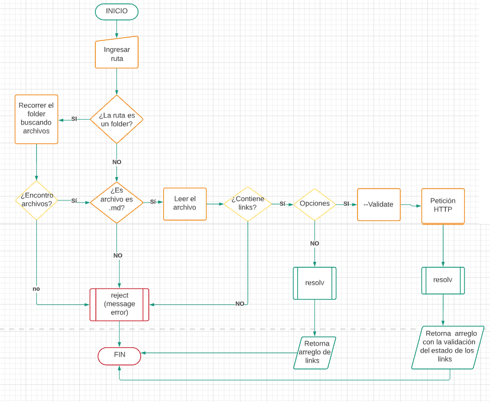
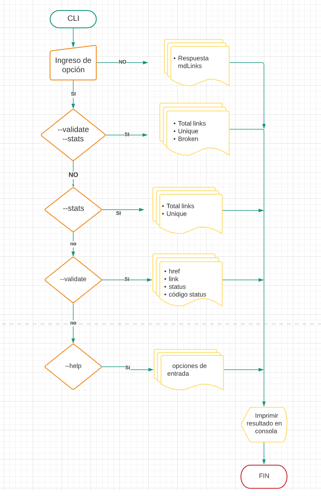
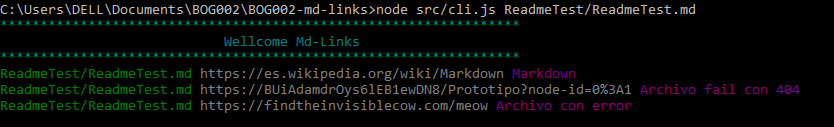
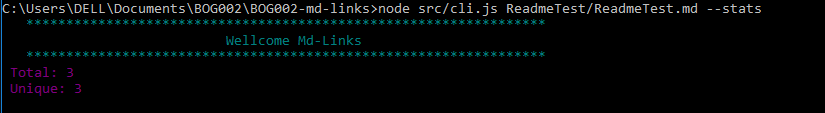
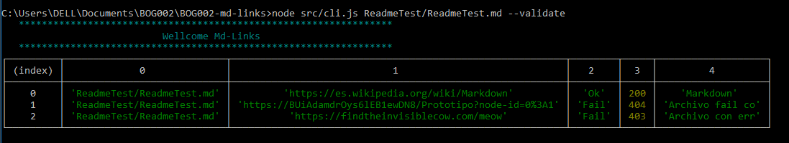
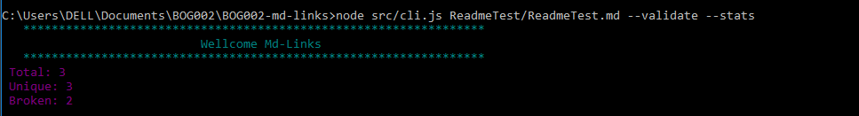
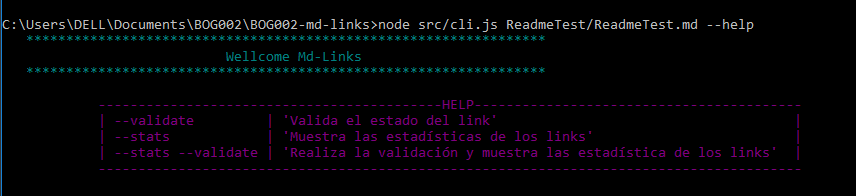

# Markdown Links

## Índice

* [1. Definición del producto](#1-Definición-del-producto)
* [1. Instalación](#2-Instalación)
* [2. Guía de uso](#3-guía-de-uso)

***

## 1. Definición del producto

La libreria mdLinks está creada con Node.js, su función es encontrar y leer archivos en formato Markdown, extrayendo los links que contengan. Si lo desea, puede ademàs hacer una verificación de los links para comprobar que esten en uso y reportar algunas estadísticas.

## 2. Instalación

`$ npm i --global DianaCato/BOG002-md-links`   

## 3. Guía de uso

## API

Importar `mdLinks` para usarlo en su proyecto de la siguiente manera:

`const mdLinks = require('md-links')`

* La función mdLinks recibe dos parámetros: `path` (ruta absoluta o relativa) y `option`.
* Retorna una promesa que se resuelve en un array de objetos que contiene la información de cada link (href, text y file).
* Si ingresa la `option { validate: true }` adicionalmente puede obtener el código de status de los links.

## CLI

En la línea de interfaz de comando (CLI), podemos ingresar los siguientes comandos:

* mdLinks path-file

* mdLinks path-file --stats

* mdLinks path-file --validate

* mdLinks path-file --validate --stats

* mdLinks --help

### Cometarios

Para este proyecto se utiliza el módulo `markdownw-links-extractor`, con una modificación disponible en la carpeta `markdownw-links-extractor-modificado`
